# PRAKTIKUM 4

## 1.TABEL PEGAWAI

- Tampilkan pegawai yang gajinya bukan 2.000.000 dan 1.250.000 !

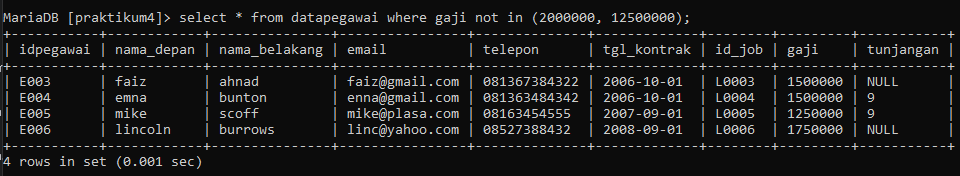

- Tampilkan pegawai yang tunjangannya NULL !

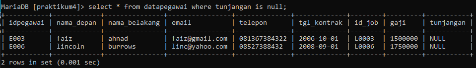

- Tampilkan pegawai yang tunjangannya NOT NULL !

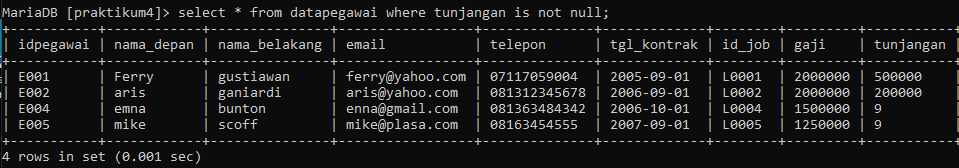

- Tampilkan / hitung jumlah baris / record tabel pegawai !

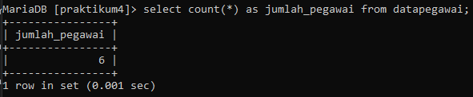

- Tampilkan / hitung jumlah total gaji ditabel pegawai !

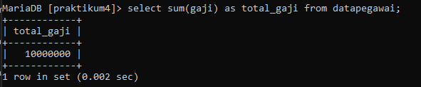

- Tampilkan / hitung rata-rata gaji pegawai !

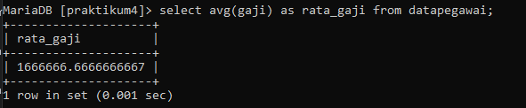

- Tampilkan gaji terkecil !

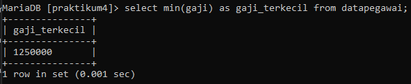

- Tampilkan gaji terbesar !

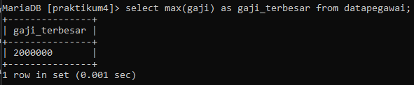

## 2.TABEL HEWAN

- Tampilkan jumlah hewan yang dimiliki setiap owner !

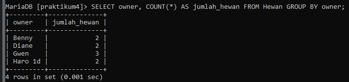

- Tampilkan jumlah hewan berdasarkan spesies !

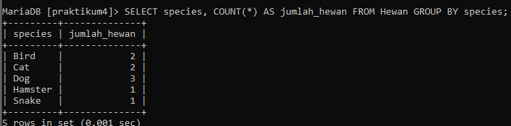

- Tampilkan jumlah hewan berdasarkan jenis kelamin !

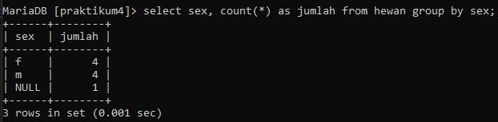

- Tampilkan jumlah hewan berdasarkan spesies dan jenis kelamin !

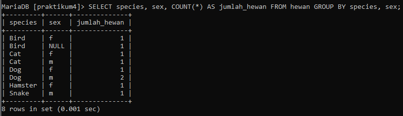

- Tampilkan jumlah hewan berdasarkan spesies (cat dan dog) dan jenis kelamin !

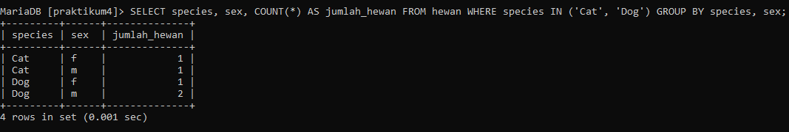

- Tampilkan jumlah hewan berdasarkan jenis kelamin yang diketahui saja !

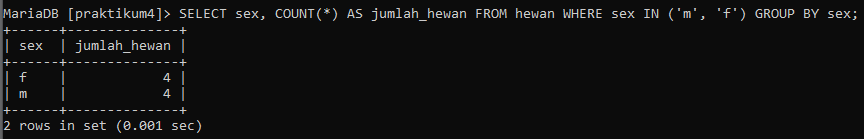
